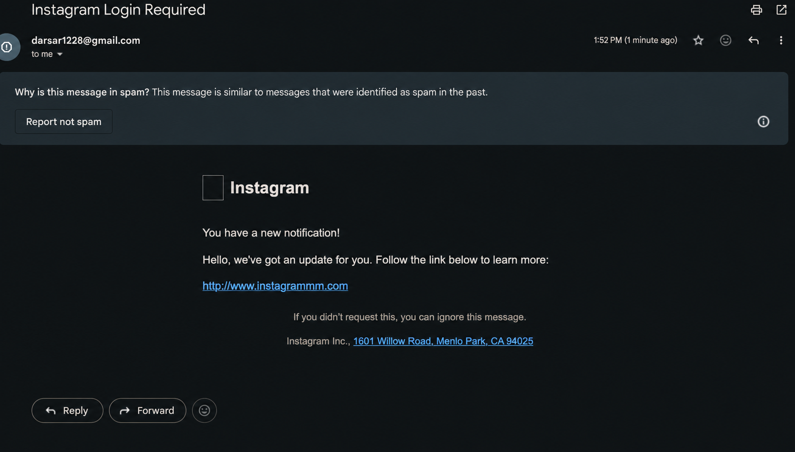
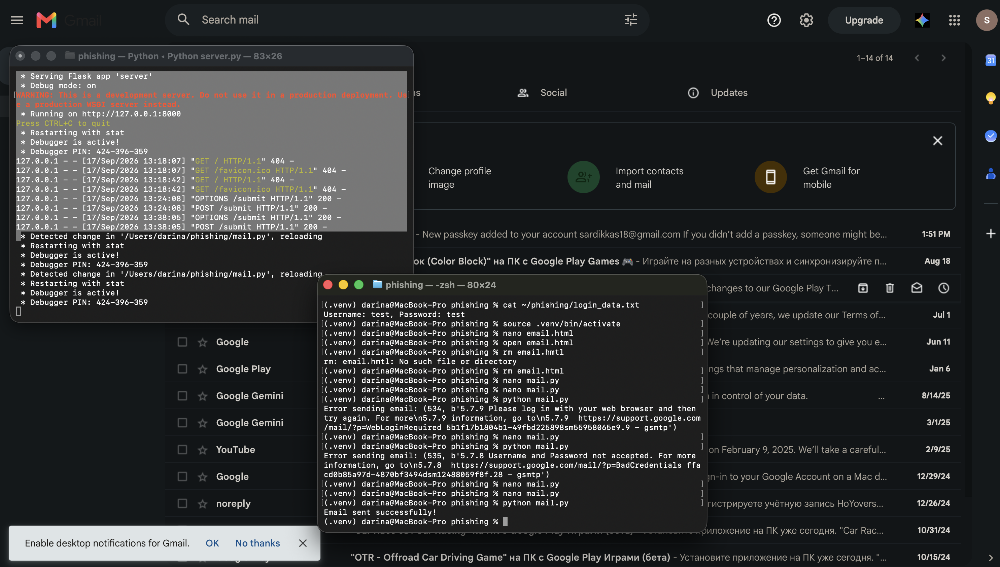
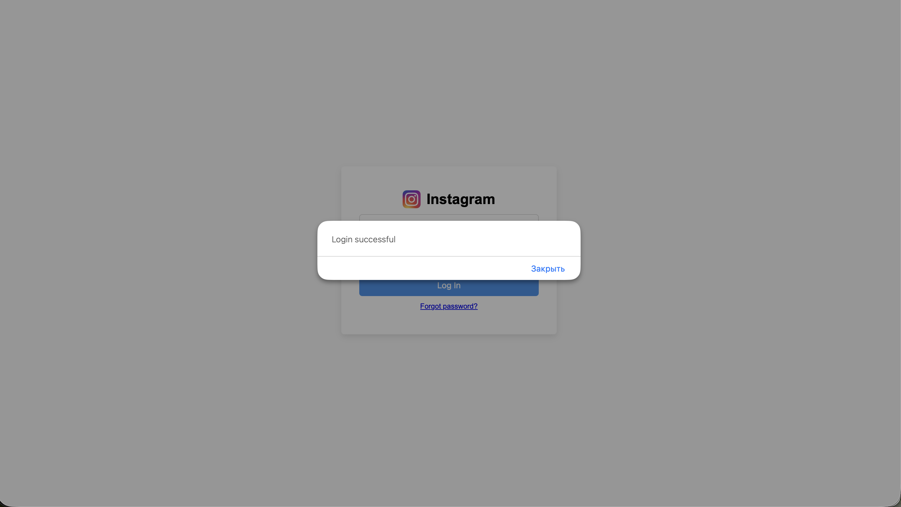
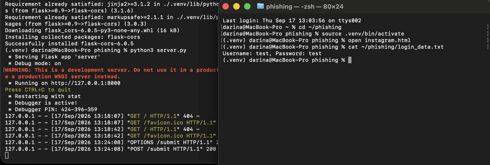

## Comprehending Phishing

ran my server.py with code from the lab.docx and changed the recipient's email in the second terminal session. also ran it.

and here i got from the login.txt all information.
