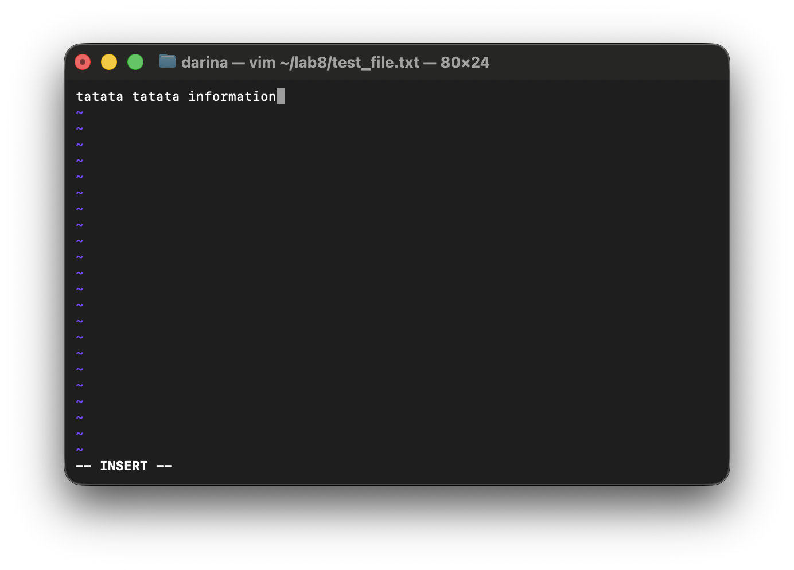

## VIM commands

```bash
darina@MacBook-Pro ~ %  mkdir ~/lab8
darina@MacBook-Pro ~ % touch ~/lab8/test_file.txt
darina@MacBook-Pro ~ % vim ~/lab8/test_file.txt
darina@MacBook-Pro ~ %
```


### other commands

```
G: go to end of file
g: go to beginning of file  
5: go to line 5 (any number)

search for word
/word: find "word" in file
n: find next occurrence
N: find previous occurrence

insert/edit:
o: insert new line below
O: insert new line above
dd: delete entire line
dw: delete word
D: delete from cursor to end of line
u: undo last action
ctrl+R: redo

write and quit
w: save file
q: quit
wq: save and quit
```

