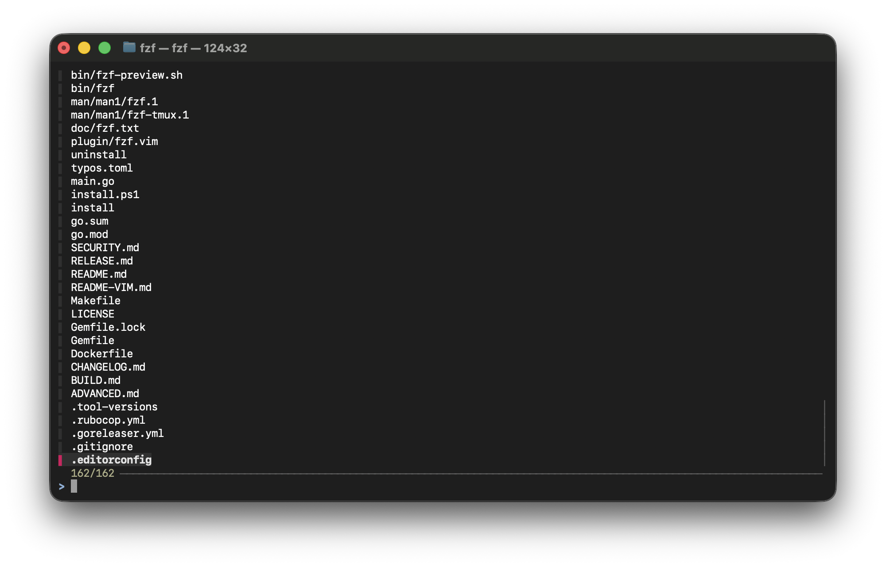

## Installing from source

```bash
darina@MacBook-Pro ~ % git clone https://github.com/junegunn/fzf.git
Cloning into 'fzf'...
remote: Enumerating objects: 20496, done.
remote: Counting objects: 100% (426/426), done.
remote: Compressing objects: 100% (239/239), done.
remote: Total 20496 (delta 343), reused 190 (delta 187), pack-reused 20070 (from 3)
Receiving objects: 100% (20496/20496), 8.53 MiB | 198.00 KiB/s, done.
Resolving deltas: 100% (13549/13549), done.
darina@MacBook-Pro ~ % cd fzf
darina@MacBook-Pro fzf % cat README.md
```
<details>
<div align="center">
  
  <a href="https://github.com/junegunn/fzf/actions"></a>
  <a href="http://github.com/junegunn/fzf/releases"></a>
  <a href="https://github.com/junegunn/fzf?tab=MIT-1-ov-file#readme"></a>
  <a href="https://github.com/junegunn/fzf/graphs/contributors"></a>
 ...
Copyright (c) 2013-2026 Junegunn Choi

Goods
-----

Grab fzf T-shirts, mugs, and stickers here: https://commitgoods.com/collections/fzf

Sponsors :heart:
----------------

I would like to thank all the sponsors of this project who make it possible for me to continue to improve fzf.

If you'd like to sponsor this project, please visit https://github.com/sponsors/junegunn.
</details>

```bash
darina@MacBook-Pro fzf % ./install
Downloading bin/fzf ...
% Total    % Received % Xferd  Average Speed   Time    Time     Time  Current
Dload  Upload   Total   Spent    Left  Speed
0     0    0     0    0     0      0      0 --:--:-- --:--:-- --:--:--     0
100 2098k  100 2098k    0     0   197k      0  0:00:10  0:00:10 --:--:--  292k
- Checking fzf executable ... 0.74.4
  Do you want to enable fuzzy auto-completion? ([y]/n) y
  Do you want to enable key bindings? ([y]/n) y

Generate /Users/darina/.fzf.bash ... OK
Generate /Users/darina/.fzf.zsh ... OK

Do you want to update your shell configuration files? ([y]/n) y

Update /Users/darina/.bashrc:
- [ -f ~/.fzf.bash ] && source ~/.fzf.bash
    + Added

Update /Users/darina/.zshrc:
- [ -f ~/.fzf.zsh ] && source ~/.fzf.zsh
    + Added

Finished. Restart your shell or reload config file.
source ~/.bashrc  # bash  (.bashrc should be loaded from .bash_profile)
source ~/.zshrc   # zsh

Use uninstall script to remove fzf.

For more information, see: https://github.com/junegunn/fzf
darina@MacBook-Pro fzf % source ~/.zshrc
darina@MacBook-Pro fzf % fzf
```
